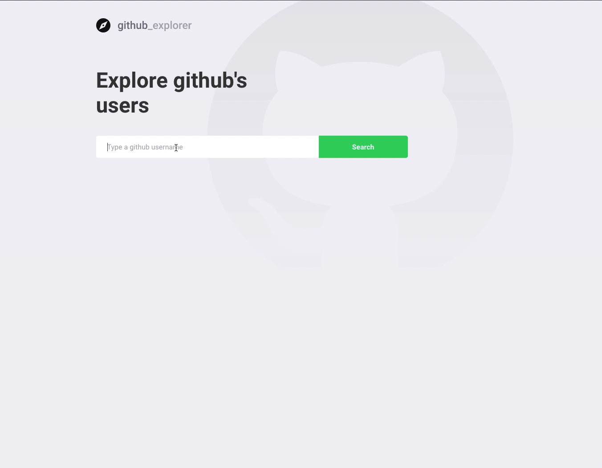

# Github User Finder

## React app to explore github's users built with React and Github api.

[See it live](https://github-finder-react-context-api.netlify.com/)

## How to run local

1 `git clone https://github.com/filippobarcellos/github_finder`

2 `cd/github_finder/yarn`

3 `yarn start`

## Todo

- Loading UI cards
